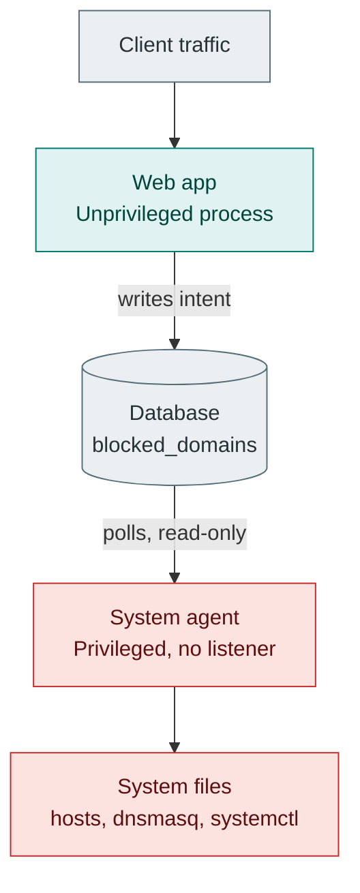
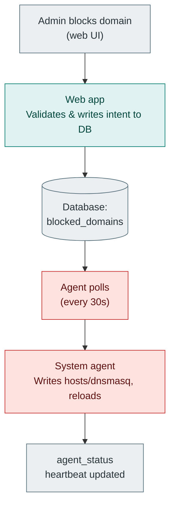
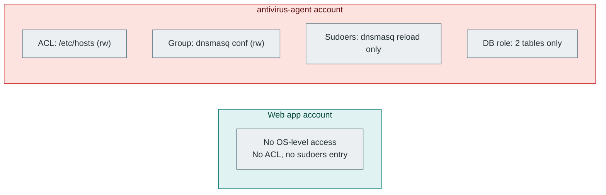

# H1 fix plan: splitting the privileged system-config writer out of the web-facing process

## 1. Problem restatement

The Spring Boot process currently does two unrelated things under one identity:

1. **Web-facing, untrusted-input-handling work**: REST API, session auth, the local HTTP/HTTPS proxy (parses attacker-influenced bytes), and the file-scanning engine (unzips and parses arbitrary uploaded content).
2. **Privileged system administration**: rewriting `/etc/hosts`, rewriting `/etc/dnsmasq.d/antivirus-blocked.conf`, and shelling out to `systemctl reload dnsmasq`.

For (2) to work at all, the process needs root (or Administrator, on Windows) or an equivalent broad grant. That means any future bug anywhere in (1) has full-system blast radius, not just application-level blast radius. The goal is to make (1) and (2) run as two separate OS processes/identities, with the narrowest possible channel between them, so that compromising the network-facing process no longer implies compromising the system.

**Non-goals for this plan:**
- Quarantine storage is out of scope, it already only needs write access to an app-owned data directory (fixed under H3), it never needed system privileges.
- The proxy-based domain blocking (`ProxyDomainBlockingService`) is out of scope too, it binds to `127.0.0.1:8081`, a non-privileged port, and needs no elevation. It stays exactly where it is, in the web app.
- This plan only addresses the two genuinely privileged operations: hosts-file writes and dnsmasq config writes/`systemctl reload`.

## 2. Target architecture

See the diagram above. In one sentence: the web app writes *intent* to the database ("these domains should be blocked"), a separate privileged agent with no network listener polls that same database and is the only thing that ever touches `/etc/hosts`, `/etc/dnsmasq.d/`, or `systemctl`.

Why database-mediated polling instead of the alternatives:

| Option | Why not |
|---|---|
| Local Unix domain socket / named pipe RPC between the two processes | Real-time, but it's a brand new local IPC surface that itself needs a message schema, versioning, and hardening, the exact kind of thing this plan is trying to reduce, not add. |
| Web app writes a plain file, agent watches it | Removes the DB dependency but still needs careful atomic-write handling, and doesn't give a clean way to report agent status back to the web app for the existing `/api/network-security/status` UI. |
| **Database polling (chosen)** | No new IPC surface at all, reuses infrastructure that already exists and is already access-controlled by the DB engine itself. The agent's blast radius, if compromised, is bounded by exactly what its DB grant allows: read one table, write one status row. Latency (poll interval) is irrelevant here, domain blocking updates are not a real-time path. |

## 3. Database contract

### 3.1 New table: `agent_status`

Replaces the web app's own `Files.isWritable(...)` probes against system paths (`DomainBlockingServiceImpl.canModifyHostsFile()`, `DnsDomainBlockingService.isDnsConfigAccessible()`). The web app should never touch those paths again, not even to check. The agent is now the sole source of truth for "can I actually enforce this."

```sql
-- V5__add_agent_status.sql
CREATE TABLE agent_status (
    id                      BIGINT PRIMARY KEY DEFAULT 1 CHECK (id = 1), -- singleton row
    hosts_file_writable     BOOLEAN NOT NULL DEFAULT FALSE,
    dns_config_writable     BOOLEAN NOT NULL DEFAULT FALSE,
    last_heartbeat_at       TIMESTAMP NOT NULL,
    last_sync_at            TIMESTAMP,
    last_sync_error         VARCHAR(500)
);

INSERT INTO agent_status (id, hosts_file_writable, dns_config_writable, last_heartbeat_at)
VALUES (1, FALSE, FALSE, CURRENT_TIMESTAMP);
```

The web app's `NetworkSecurityController.getStatus()` reads this row instead of calling `hostsFileDomainBlockingService.isHostsFileAccessible()`/`isAdmin()` and `dnsDomainBlockingService.isDnsConfigAccessible()`. If `last_heartbeat_at` is older than, say, 3x the agent's poll interval, the web app should report the agent as down (`"agentReachable": false`) rather than trusting stale `hosts_file_writable`/`dns_config_writable` values.

### 3.2 Existing table: `blocked_domains`

No schema change needed, this already exists and already has the shape the agent needs (`domain`, `active`, `reason`). The agent only ever runs `SELECT domain, reason FROM blocked_domains WHERE active = true`, never a write against this table. All writes to `blocked_domains` continue to come from the web app (`DomainBlockingServiceImpl.blockDomain()`/`unblockDomain()`, which already validate via `DomainValidator` before persisting, that validation is preserved and now doubles as the agent's input sanitization boundary too, since the agent trusts whatever's already in this table).

### 3.3 Database roles (deployment runbook, not a Flyway migration)

Granting privileges to a new role is an operator action, not something the app's own migration user should be able to do (if it could grant arbitrary privileges, that's itself a privilege escalation path). This is a one-time script a DBA/operator runs against the production database:

```sql
-- run once, by an operator with GRANT privileges, not by the app
CREATE ROLE antivirus_agent LOGIN PASSWORD '...';
GRANT SELECT ON blocked_domains TO antivirus_agent;
GRANT SELECT, UPDATE ON agent_status TO antivirus_agent;
-- explicitly no grants on app_users, scan_results, or anything else
REVOKE ALL ON app_users FROM antivirus_agent;
REVOKE ALL ON scan_results FROM antivirus_agent;
```

Document this in `README.md` under a new "Production deployment" section, alongside the existing `DB_URL`/`ADMIN_USERNAME` environment variable docs.

## 4. New component: `system-agent`

### 4.1 Why a separate, dependency-light module (not a Spring Boot app)

The agent is the privileged half of the split; the smaller and more auditable its own dependency graph, the smaller the thing you're trusting with root. It should not pull in Spring, Hibernate, or any web framework. It needs exactly: a JDBC driver, a scheduler (a single-thread `ScheduledExecutorService` is enough, no library needed), and the JDK's own `ProcessBuilder`/`Files` APIs, which are already what `DnsDomainBlockingService` and `DomainBlockingServiceImpl` use today.

### 4.2 Proposed layout

```
system-agent/
├── pom.xml                      # standalone, no spring-boot-starter-parent
├── src/main/java/com/antivirus/agent/
│   ├── AgentMain.java            # entry point, scheduling loop
│   ├── DomainSyncTask.java       # polls blocked_domains, diffs, writes
│   ├── HostsFileWriter.java      # extracted from DomainBlockingServiceImpl,
│   │                             #   trimmed to just the write logic
│   ├── DnsmasqWriter.java        # extracted from DnsDomainBlockingService
│   ├── AgentStatusReporter.java  # writes heartbeat + writability probes
│   └── AgentConfig.java          # reads config from env vars / a properties
│                                 #   file, e.g. /etc/antivirus-agent/agent.properties
└── src/test/java/com/antivirus/agent/
    ├── DomainSyncTaskTest.java
    ├── HostsFileWriterTest.java
    └── DnsmasqWriterTest.java
```

`pom.xml` dependencies: `org.postgresql:postgresql` (or whatever JDBC driver matches the deployed DB), `junit-jupiter` + `mockito-core` for tests (test scope only). Nothing else. No `spring-boot-starter-parent` inheritance, this keeps the artifact small and its dependency tree independently auditable by `mvn dependency:tree` without pulling in the web app's entire surface (Spring MVC, Jackson, Hibernate, etc., none of which the agent needs).

### 4.3 What moves, what's rewritten, what's deleted

| Current location | What happens to it |
|---|---|
| `DomainBlockingServiceImpl.updateHostsFile()` (the actual `/etc/hosts` read-modify-write-with-backup logic) | Moved essentially as-is into `system-agent`'s `HostsFileWriter`. The backup/restore-on-failure logic is good and should be preserved. |
| `DomainBlockingServiceImpl.canModifyHostsFile()` | Moved into `system-agent`'s `AgentStatusReporter` (this is exactly the probe that now feeds `agent_status.hosts_file_writable`). |
| `DomainBlockingServiceImpl.blockDomain()`/`unblockDomain()` (the parts that write to the DB) | **Stays in the web app.** This is the "intent" write, it's just a `blocked_domains` INSERT/UPDATE now, no file I/O. |
| `DnsDomainBlockingService.updateDnsConfig()`/`restoreDnsConfig()` (the write + `systemctl` logic) | Moved into `system-agent`'s `DnsmasqWriter`, gated the same way it already is today (behind the `app.domain-blocking.dns.enabled` flag, now read from the agent's own config file instead of Spring properties). |
| `DnsDomainBlockingService.isDnsConfigAccessible()` | Moved into `AgentStatusReporter`. |
| `CompositeDomainBlockingService` | **Deleted.** Its entire reason for existing (coordinating multiple blocking mechanisms including the privileged ones) is superseded by the agent. Its `@Scheduled` method is exactly the thing that caused the H2 bug (privileged writes firing on a timer with no user action), removing the class removes that risk at the root instead of only gating it. Delete `CompositeDomainBlockingServiceTest.java` too, its "validate before persistence" coverage is preserved because `DomainValidator.validateAndNormalize()` still runs in `DomainBlockingServiceImpl.blockDomain()`, which remains the only write path into `blocked_domains`. |
| `NetworkSecurityController`'s `CompositeDomainBlockingService` field | Deleted along with the class above (this finally resolves the loose end noted in the H2 change). |
| `NetworkSecurityController.getStatus()` | Rewritten to read `agent_status` (via a new `AgentStatusRepository`) instead of calling `isHostsFileAccessible()`/`isAdmin()`/`isDnsConfigAccessible()` directly. |
| `DomainBlockingServiceImpl` | Trimmed down to only: validate + persist to `blocked_domains`. All `Files`/`ProcessBuilder` code removed. Renamed conceptually to reflect that it no longer touches the filesystem (keep the interface name `DomainBlockingService` for compatibility, or rename if you're comfortable touching the controller too). |
| `DnsDomainBlockingService` | Deleted from the web app entirely (its logic now lives only in `system-agent`). |

## 5. Privilege model (Linux, the real production target)

Root is not actually required for either operation if you scope permissions correctly. This is the concrete, minimal grant set:

1. **Dedicated service account**: create a system user with no login shell, e.g. `antivirus-agent`. The web app continues running as its own unprivileged account (or the same low-privilege account used today, whichever your deployment already has, just confirm it is *not* root).

2. **`/etc/hosts` access via POSIX ACL, not root, not a capability**: file DAC permissions (owner/group/other) can't natively grant "one specific non-owner user may write this file" without either changing ownership (too broad) or an ACL. Use `setfacl`:
   ```
   sudo setfacl -m u:antivirus-agent:rw /etc/hosts
   ```
   This grants exactly the ability to read/write that one file to that one user. No `sudo`, no root, no Linux capability needed for this path at all. (Verify with `getfacl /etc/hosts` after.)

3. **`/etc/dnsmasq.d/antivirus-blocked.conf` access via group ownership**: since this file is fully owned by the application (not a shared system file like `/etc/hosts`), a simple group grant is cleaner than an ACL:
   ```
   sudo mkdir -p /etc/dnsmasq.d
   sudo touch /etc/dnsmasq.d/antivirus-blocked.conf
   sudo chown root:antivirus-agent /etc/dnsmasq.d/antivirus-blocked.conf
   sudo chmod 664 /etc/dnsmasq.d/antivirus-blocked.conf
   ```

4. **`systemctl reload dnsmasq` via a narrowly scoped sudoers rule**: reloading a systemd unit is a privileged operation with no ACL equivalent, so this is the one place a `sudo` grant is genuinely necessary. Scope it to the exact command, no wildcards:
   ```
   # /etc/sudoers.d/antivirus-agent
   antivirus-agent ALL=(root) NOPASSWD: /usr/bin/systemctl reload dnsmasq
   ```
   If this line is ever compromised, the attacker gains the ability to reload one specific systemd unit. That's the entire blast radius, compared to the current state where compromising the web process can mean full root.

5. **Database credentials**: the agent's JDBC connection uses the `antivirus_agent` role from 3.3 above, which cannot read `app_users` (password hashes) or `scan_results` (potentially sensitive file paths/scan data) even if the agent process itself is fully compromised.

6. **systemd unit for the agent** (`/etc/systemd/system/antivirus-agent.service`), run as the dedicated user, with additional systemd-level sandboxing on top of the ACL/sudoers scoping above:
   ```ini
   [Unit]
   Description=Antivirus system agent (privileged domain-blocking sync)
   After=network.target postgresql.service

   [Service]
   Type=simple
   User=antivirus-agent
   Group=antivirus-agent
   ExecStart=/usr/bin/java -jar /opt/antivirus-agent/system-agent.jar
   Restart=on-failure
   RestartSec=5
   # No network needed by this process at all
   PrivateNetwork=yes
   # Extra defense in depth even within the already-minimal grant above
   ProtectSystem=strict
   ReadWritePaths=/etc/hosts /etc/dnsmasq.d
   NoNewPrivileges=yes

   [Install]
   WantedBy=multi-user.target
   ```
   `PrivateNetwork=yes` is worth calling out specifically: it gives the agent its own empty network namespace, so even if something were badly wrong with it, it cannot make or accept any network connection at all, including to the database. **This conflicts with the agent needing DB access.** Resolve this by having the agent connect to the DB over a Unix domain socket (Postgres supports this natively) rather than TCP, Unix sockets aren't blocked by `PrivateNetwork`, and this closes off the agent's network attack surface entirely rather than just restricting it. If the DB is genuinely remote and a Unix socket isn't possible, drop `PrivateNetwork=yes` and rely on the DB grant (3.3) plus firewall egress rules limiting the agent to the DB host/port only.

7. **Web app's own systemd unit**: update it (or its Docker/container equivalent) to explicitly confirm it does *not* run as root and has no ACL/sudoers grants at all. This is the actual point of the exercise, make it explicit and checked rather than implicit.

### 5.1 Windows note

The current code already branches on OS (`DomainBlockingServiceImpl`'s `@Value` default picks `C:/Windows/System32/drivers/etc/hosts` on Windows, and `DnsDomainBlockingService.getDnsInstructions()` already says dnsmasq isn't supported on Windows, hosts-file blocking only). For a Windows deployment, the equivalent split is: the agent runs as a separate Windows service under a dedicated low-privilege service account, granted `FullControl` on `C:\Windows\System32\drivers\etc\hosts` specifically via `icacls`, while the web app's own service account has no such grant. There's no dnsmasq/`systemctl` equivalent to worry about on Windows since that path is already Linux-only. This is a smaller lift than the Linux side and can follow the same shape once the agent module exists.

## 6. Web app changes, file by file

- `NetworkSecurityController.java`: remove the `CompositeDomainBlockingService` field entirely (and its import). Rewrite `getStatus()` to query a new `AgentStatusRepository` (a plain Spring Data JPA repository over the new `agent_status` table) instead of calling into `DomainBlockingService`/`DnsDomainBlockingService` writability probes.
- `DomainBlockingServiceImpl.java`: delete `updateHostsFile()`, `canModifyHostsFile()`, `synchronizeHostsFile()`, and the `@Scheduled` annotation on it, along with the `hasAdminPrivileges`/`hostsFileAccessible` fields and the `hostsFilePath` constructor injection. What remains: `blockDomain()`/`unblockDomain()`/`getBlockedDomains()`, all DB-only now.
- `DnsDomainBlockingService.java`: delete entirely.
- `CompositeDomainBlockingService.java`: delete entirely.
- New: `AppUser`-style plain entity/repository pair for `agent_status` in the web app (`model/AgentStatus.java`, `repository/AgentStatusRepository.java`), read-only from the web app's perspective (it should never write to this table, only the agent does).
- `src/main/resources/db/migration/V5__add_agent_status.sql`: the migration from 3.1.
- Remove `app.domain-blocking.dns.enabled` from the web app's `application.properties` (the H2 fix), it moves to the agent's own config, since the web app no longer has a DNS-write code path to gate at all.
- Test files to update/remove: delete `CompositeDomainBlockingServiceTest.java`. `NetworkSecurityControllerTest.java` needs its `@MockBean CompositeDomainBlockingService` removed and a new `@MockBean AgentStatusRepository` added, with assertions on `getStatus()` updated to check the new `agent_status`-driven response shape instead of the old `isHostsFileAccessible()`/`isDnsConfigAccessible()` mock expectations.

## 7. Testing strategy

- **`system-agent` unit tests**: `DomainSyncTaskTest` mocks the JDBC layer (or uses an in-memory H2/Testcontainers Postgres) and asserts the diff-and-write logic; `HostsFileWriterTest`/`DnsmasqWriterTest` operate against a temp file standing in for `/etc/hosts`/the dnsmasq conf (exactly the pattern the current hosts-file backup/restore logic already lends itself to, since it already takes the path as a constructor parameter).
- **Contract test**: a test that starts a real (test) Postgres, has the web app write a `blocked_domains` row, runs the agent's sync logic once against the same DB, and asserts the resulting file content, this is the one test that actually exercises the full intended contract end to end rather than each side in isolation.
- **Staging validation checklist** (manual, before first production cutover):
  1. Deploy the agent to staging with the ACL/sudoers/systemd config from 5.
  2. Block a domain through the web app UI.
  3. Confirm `agent_status.last_sync_at` advances and `/etc/hosts` (or the dnsmasq conf) on the staging box actually contains the new entry within one poll interval.
  4. Stop the agent process; confirm the web app's `/api/network-security/status` correctly reports the agent as unreachable rather than silently showing stale `hosts_file_writable: true`.
  5. Confirm the web app's own service account genuinely cannot write `/etc/hosts` (`sudo -u <webapp-user> touch /etc/hosts` should fail).

## 8. Rollout sequencing

1. Land the `agent_status` migration and the read-only `AgentStatusRepository` in the web app first, with `NetworkSecurityController` falling back to reporting "agent not yet deployed" if the row's `last_heartbeat_at` is null/absent. This is a safe, no-behavior-change deploy on its own.
2. Build and deploy `system-agent` to staging, wire up the ACLs/sudoers/systemd unit, verify against the checklist in 7.
3. Once staging is green, deploy the agent to production *before* removing the web app's own privileged code, so there's a window where both are technically present but the agent is the one actually keeping `agent_status` fresh.
4. Cut over: remove `DnsDomainBlockingService`, `CompositeDomainBlockingService`, and the file-writing parts of `DomainBlockingServiceImpl` from the web app, revoke the web app's own OS-level access to `/etc/hosts`/`/etc/dnsmasq.d` if it had any (it shouldn't have needed any beyond what `canModifyHostsFile()` was probing for, which is being deleted anyway).
5. Confirm in production that the web app's process user has no filesystem grant on those paths and no sudoers entry at all, that's the actual completion criterion for H1, not just "the agent exists."

## 9. Effort estimate

Roughly: 1 day to instantiate the `system-agent` module skeleton and move the write logic over largely as-is; 1 to 2 days for the DB contract, migration, and web-app-side rewiring (`NetworkSecurityController`, repository, deleted classes, updated tests); 1 day for the systemd/ACL/sudoers provisioning and a staging run-through. Call it a multi-day to one-week effort for one person familiar with the codebase, not a multi-week rewrite, most of the actual file-writing logic already exists and is already reasonably well isolated in `DomainBlockingServiceImpl` and `DnsDomainBlockingService`, this plan is primarily about *where* that code runs and *what* can reach it, not rewriting the logic itself.

## 10. Diagrams

Three diagrams support this plan, in Mermaid rather than raw SVG so they render natively in GitHub, GitLab, Obsidian, VS Code (with the Markdown Preview Mermaid extension), and most other markdown viewers without any XML/DTD validation issues.

### 10.1 Target architecture

The two-process split at a glance: client traffic only ever reaches the unprivileged web app, which writes intent to the database; the privileged agent, with no network listener, is the only thing that ever touches system files.



### 10.2 End-to-end flow of blocking a domain

What actually happens, in order, from the moment an admin clicks "block" to the moment `/etc/hosts` (or the dnsmasq config) reflects it.



### 10.3 Privilege boundary by account

This is the actual security payoff of the whole plan: exactly what each service account can touch. The web app account has zero OS-level filesystem or sudo grants. The dedicated agent account has exactly four, each scoped as narrowly as the operation allows.

