# SecureGuard Antivirus

[](https://github.com/Dhruv0306/Antivirus/actions/workflows/build.yml)
[](https://github.com/Dhruv0306/Antivirus/actions/workflows/integration-test.yml)
[](https://github.com/Dhruv0306/Antivirus/actions/workflows/pressure-test.yml)
[](https://github.com/Dhruv0306/Antivirus/actions/workflows/threat-intel-feed-check.yml)
[](https://github.com/Dhruv0306/Antivirus/releases)

A full-stack antivirus application with real-time file scanning, quarantine management, and network protection. The backend is Spring Boot, the frontend is React, and privileged OS-level operations (hosts file writes, DNS blocking) run in a separate, narrowly-scoped `system-agent` process rather than inside the web-facing app.

## Overview

- File, directory, and full-system scanning with a three-tier verdict (`CLEAN`, `SUSPICIOUS`, `MALICIOUS`)
- Quarantine and delete workflows for infected files, with per-user ownership checks
- Role-based access: `USER` accounts can scan and see their own history; `ADMIN` accounts get full history, quarantine management, and network security controls
- Network protection: domain blocking and a local blocking proxy, backed by a privileged `system-agent` that owns the actual hosts file / DNS writes
- Scan history and reporting, stored in a relational schema managed by Flyway

## Screenshots

The frontend uses a dark "Night Watch" theme: charcoal surfaces, a single
muted gold accent, and hairline borders instead of shadow-heavy cards.

<table>
<tr>
<td width="50%">

**Sign in**
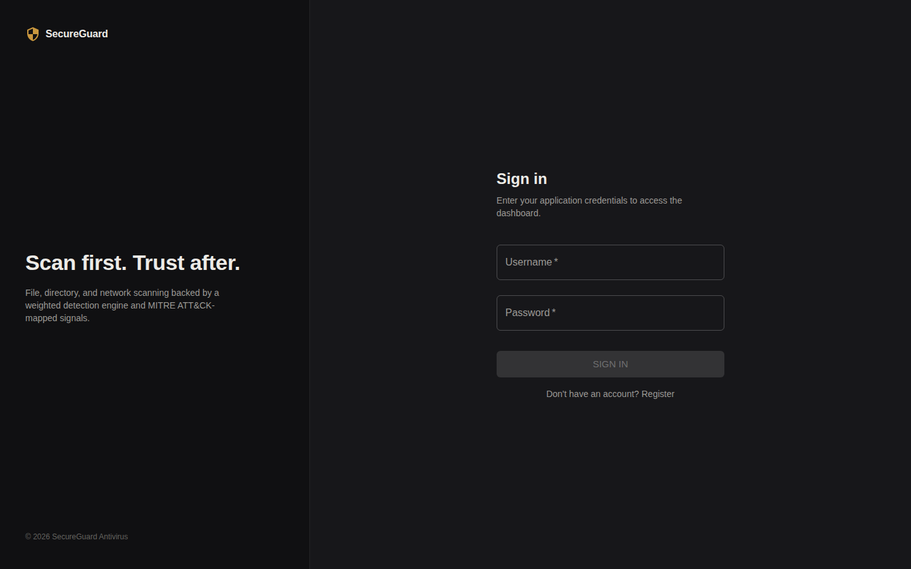

</td>
<td width="50%">

**Create account**
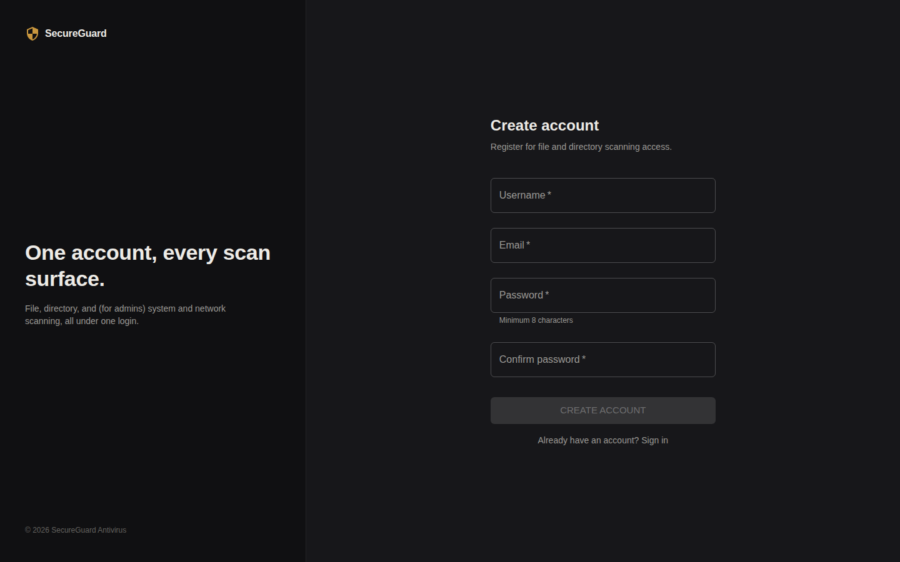

</td>
</tr>
<tr>
<td width="50%">

**Dashboard**
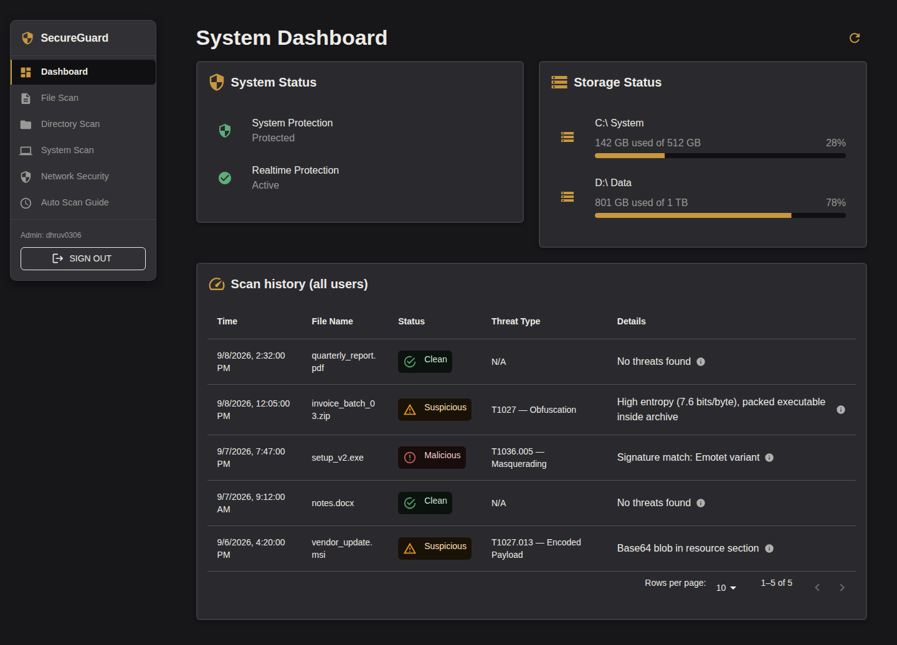

</td>
<td width="50%">

**File scan**
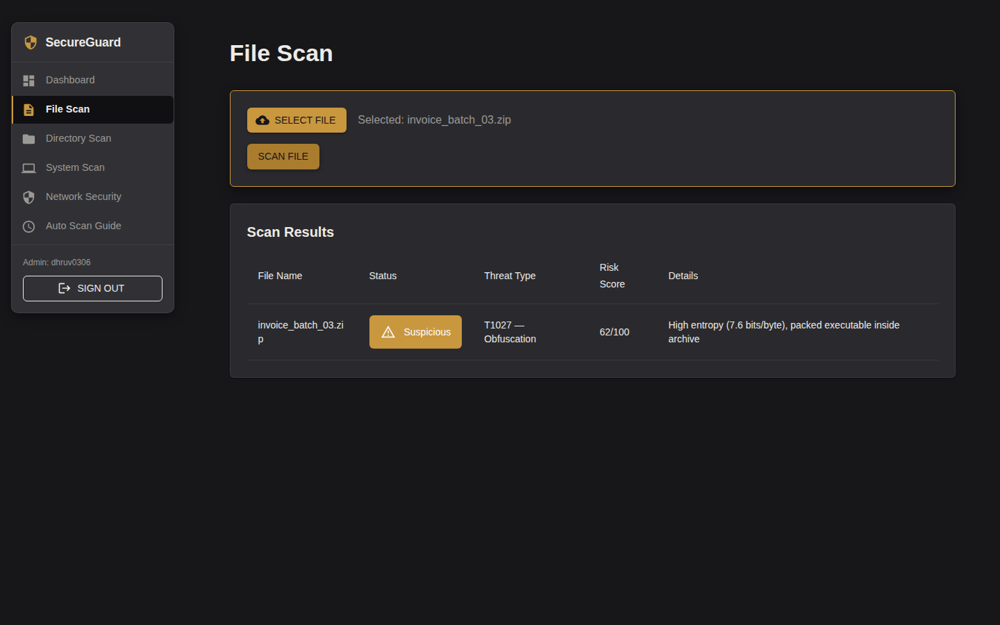

</td>
</tr>
<tr>
<td width="50%">

**Directory scan**
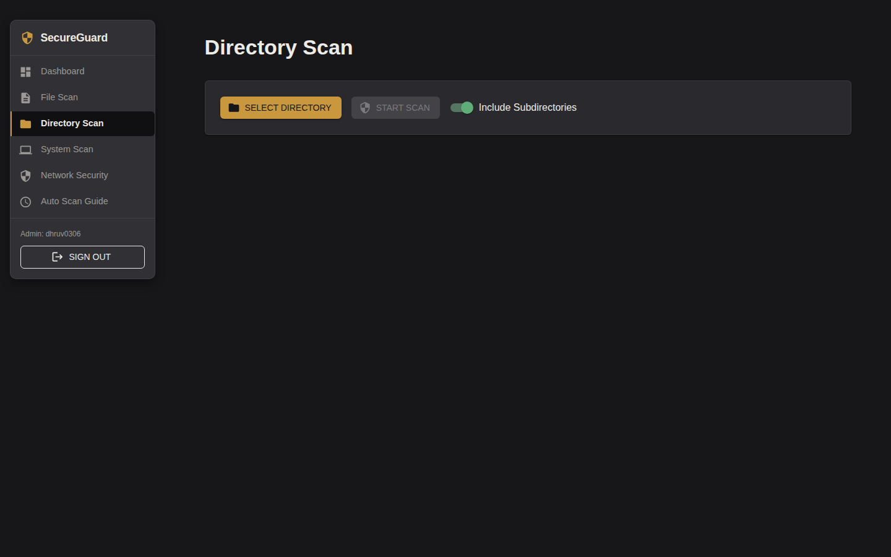

</td>
<td width="50%">

**System scan**
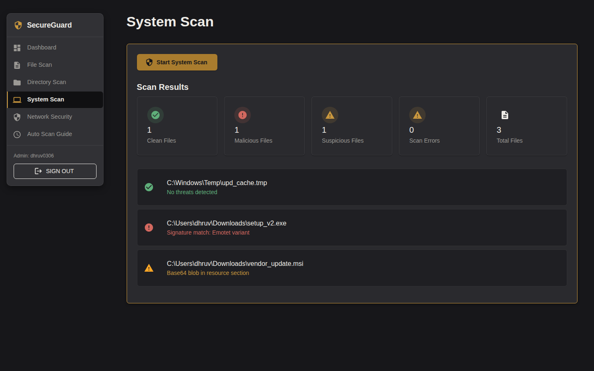

</td>
</tr>
<tr>
<td width="50%">

**Network security**
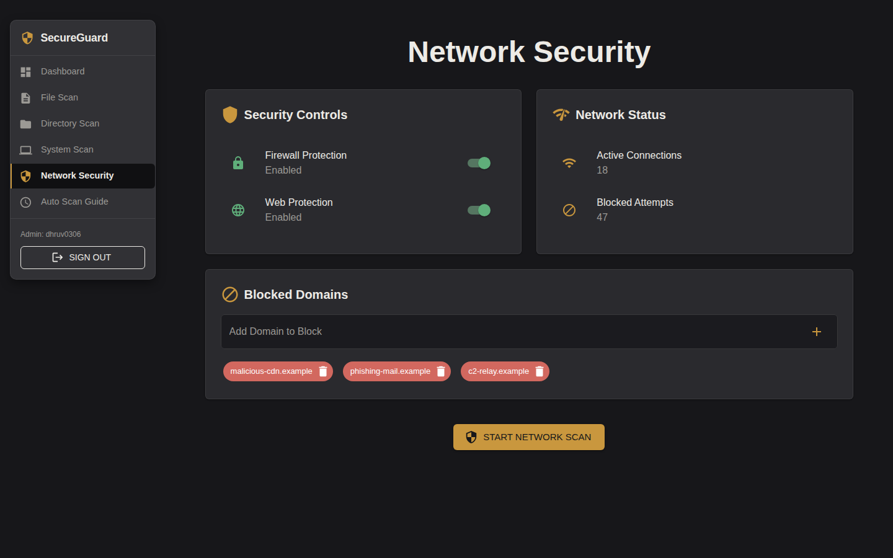

</td>
<td width="50%">

**Auto-scan setup guide**
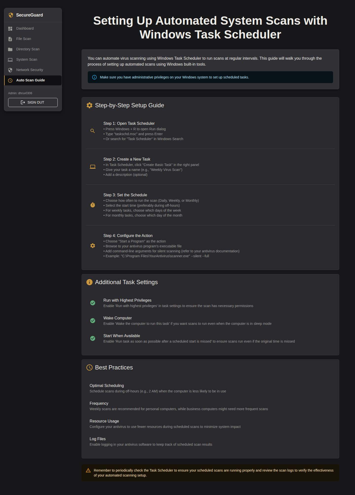

</td>
</tr>
</table>

## Tech stack

**Backend**
- Spring Boot 4.1.0, Java 21, Maven
- Spring Security (session-based auth, `@PreAuthorize` role checks, BCrypt password hashing)
- H2 in PostgreSQL compatibility mode, Flyway migrations, Hibernate/JPA
- Caffeine for in-memory rate limiting on the auth endpoints

**Frontend**
- React 18, Vite, MUI v5
- React Router, axios
- Vitest + Testing Library

**system-agent** (`system-agent/`)
- A separate Spring Boot process, deployed and run under its own OS identity
- Owns every privileged filesystem/OS write (hosts file, dnsmasq config)
- Talks to the same database as the web app through a single `agent_status` row and a narrowly-scoped `antivirus_agent` DB role (`SELECT` on `blocked_domains`, `SELECT`+`UPDATE` on `agent_status`, nothing else)
- See `system-agent/deploy/README.md` for local and Linux deployment instructions

## Project structure

```
Antivirus/
├── src/
│   ├── main/java/com/antivirus/
│   │   ├── config/         # Security, CORS, datasource safety
│   │   ├── controller/     # AuthController, AntivirusController, NetworkSecurityController
│   │   ├── dto/
│   │   ├── exception/
│   │   ├── model/          # ScanResult, AppUser, BlockedDomain, AgentStatus, ...
│   │   ├── repository/
│   │   ├── service/ + service/impl/
│   │   └── util/
│   ├── main/resources/
│   │   ├── application*.properties   # default / dev / local / prod
│   │   └── db/migration/             # Flyway V1..V7
│   └── test/java/com/antivirus/      # unit tests (mocked collaborators)
├── system-agent/
│   ├── src/main/java/com/antivirus/agent/
│   ├── src/test/java/com/antivirus/agent/
│   └── deploy/            # systemd unit, sudoers, provisioning scripts, DB role SQL
├── frontend/
│   └── src/{components,api,theme,utils,context}/
├── docs/
│   ├── plans/              # the H1 privilege-split design, rollout runbook, staging checklist, retrospective
│   └── deployment/         # provision-agent-db-role.sql
└── .github/workflows/      # CI: build, unit tests, security scans, release
```

## Getting started

### Prerequisites
- JDK 21
- Node.js 18+ and npm
- Maven 3.9+

### Backend
```bash
mvn clean install
mvn spring-boot:run
```
The API listens on `http://localhost:8080`. Default profile runs against an in-memory H2 database with no persistence between restarts; use the `local` or `prod` profile to run against a file-backed or real PostgreSQL-compatible database (see "Database" below).

`ADMIN_USERNAME` and `ADMIN_PASSWORD` must be set (via environment variables or a `.env` file at the project root, picked up by `spring.config.import`); there is no built-in default admin account.

### Frontend
```bash
cd frontend
npm install
npm run dev
```
The dev server runs on `http://localhost:5000`.

### system-agent
See `system-agent/deploy/README.md`. It can run standalone against the same local H2 file for quick testing, no systemd or root privileges required for that path.

## Configuration

| Concern | Location |
|---|---|
| Backend settings, profiles | `src/main/resources/application*.properties` |
| Security (auth, CORS, rate limiting) | `src/main/java/com/antivirus/config/SecurityConfig.java` |
| Frontend API base URL | derived from `window.location` at runtime, see `frontend/src/api/` |
| Frontend env vars | `frontend/.env.example` (copy to `.env.development` for local overrides; Vite does not read `.env.dev`) |

Key environment variables: `DB_URL`, `DB_USERNAME`, `ADMIN_USERNAME`, `ADMIN_PASSWORD`, `CORS_ALLOWED_ORIGINS`, `TRUSTED_PROXY_IPS`, `QUARANTINE_DIR`, `SYSTEM_SCAN_RESULT_CHUNK_SIZE`.

## Database and migrations

Schema changes are managed with [Flyway](https://flywaydb.org/); scripts live in `src/main/resources/db/migration/` and run automatically against whatever `DB_URL` points to, except under the `dev` profile, which sets `spring.flyway.enabled=false` and relies on Hibernate's `ddl-auto=update` for faster local iteration.

To see a migration actually run, use the `local` or `prod` profile:
```bash
mvn spring-boot:run "-Dspring-boot.run.profiles=local"
```
Then inspect the result via the H2 console at `/h2-console` (JDBC URL `jdbc:h2:file:./data/antivirus_local;MODE=PostgreSQL;AUTO_SERVER=TRUE`, from `application-local.properties`). `AUTO_SERVER=TRUE` matters if the app is still running when you connect: H2's embedded file mode locks the database to whichever process opened it first, and the console connection fails with "file is locked" without it.

### `agent_status` table

Added by `V5__add_agent_status.sql` as part of the privilege split (see `docs/plans/h1-privilege-split-plan.md`, section 3). Written only by the `system-agent` process; read only by the web app, to answer "can hosts-file/DNS blocking actually be enforced right now" for the network security dashboard. The web app never writes to this table.

### Production: provisioning the agent's database role

Before deploying `system-agent` to a new environment, an operator with database admin privileges runs this once:
```bash
psql -h <host> -U <admin-user> -d antivirus -f docs/deployment/provision-agent-db-role.sql
```
This is deliberately a manual, one-time step rather than a Flyway migration: the app's own migration identity should never be able to grant itself, or anything else, additional database privileges. Local and dev profiles use file-based H2 and don't need this.

## Testing

```bash
# Backend unit tests
mvn test

# Frontend
cd frontend && npm test

# Full end-to-end integration tests (real Spring context, real HTTP calls)
mvn verify -Pintegration

# Load/pressure tests, plus a 10,000 file synthetic detection-accuracy corpus
mvn verify -Ppressure

# Black-box API tests against a real running instance (separate from the
# above: no embedded Spring context, just plain HTTP against whatever's
# listening on API_BASE_URL)
mvn clean package -DskipTests
java -jar target/antivirus-*.jar --spring.profiles.active=dev &
pip install requests
API_BASE_URL=http://localhost:8080 python3 tests/api_test.py
```

CI runs unit tests, security scans (Semgrep, SpotBugs/Find Security Bugs, OWASP Dependency-Check, TruffleHog), and the `system-agent` privilege simulation on every push and PR. Integration tests, pressure tests, and the Python API test suite all run on their own schedule and triggers; see `.github/workflows/`.

### Pressure and accuracy metrics

`mvn verify -Ppressure` runs four suites under `src/test/java/com/antivirus/pressure/`:

- `EndpointPressureIT`: concurrent load against the app (unauthenticated traffic burst, concurrent authenticated scans, and the auth rate limiter under a real burst)
- `ScanAccuracyIT`: scans a 10,000 file synthetic, safely labeled corpus through the real scan endpoint and builds a confusion matrix (the corpus is generated in memory at test time, not sourced from any real malware collection)
- `ScanEvasionIT`: adversarial evasion resistance, false-positive resistance against legitimate content, known-malware hash coverage against real published IOCs, and known-good resistance against real open-source archives
- `EntropyDetectionIT`: Shannon-entropy packer detection, both a portable synthetic check and a real UPX-packed-binary check when `upx` is available

`ThreatIntelSignatureService`'s live feed integration has its own separate, non-PR-blocking nightly check (`mvn verify -Plive-feed-check`, see `.github/workflows/threat-intel-feed-check.yml`).

On every scheduled or manually-dispatched run, CI regenerates and commits [`docs/pressure-metrics.md`](docs/pressure-metrics.md) with the full numbers, and the same data as one image per section below:

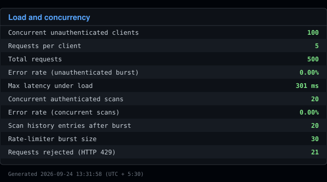
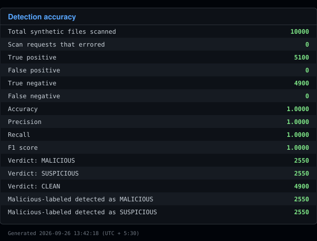
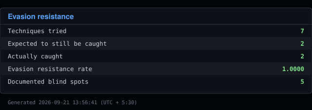
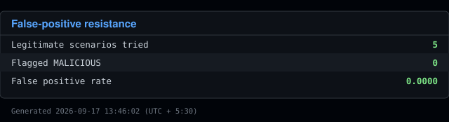
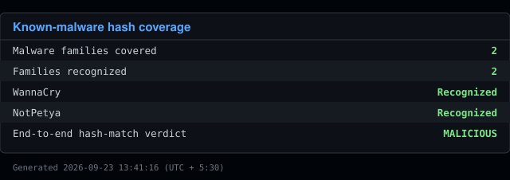
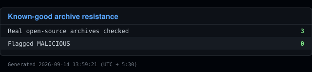
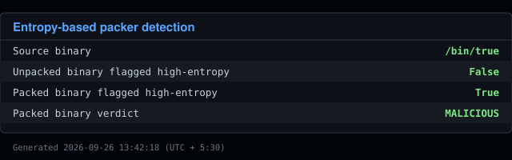

Every evasion technique in `ScanEvasionIT` is cited against a real, external, documented source (a MITRE ATT&CK technique ID where one applies), not left resting on an inline code comment. Kept as a real table here rather than another image since citation text is long, unstructured prose that a fixed-width SVG table doesn't render well:

<!-- EVASION-CITATIONS:START -->
| Technique | Expected caught | Actual verdict | Citation |
|---|---|---|---|
| Extension masquerade: invoice.pdf with a real MZ header inside | Yes | MALICIOUS | MITRE ATT&CK T1036.008 Masquerade File Type |
| Ransomware extension case variation: .LOCKED instead of .locked | Yes | MALICIOUS | No specific MITRE ATT&CK technique; this is an implementation-robustness regression guard on the string-matching logic behind ransomware file-extension detection (itself associated with T1486 Data Encrypted for Impact), not a named attacker technique in its own right. |
| Keyword fragmentation: hyphenating 'bit-coin' to break the ransomware text pattern | Known blind spot | CLEAN | MITRE ATT&CK T1027 Obfuscated Files or Information |
| Base64-encoded ransom note: same message, never appears as plaintext | Known blind spot | CLEAN | MITRE ATT&CK T1027.013 Encrypted/Encoded File |
| Innocuous filename carrying a real trojan-shaped payload description | Known blind spot | CLEAN | MITRE ATT&CK T1036.005 Match Legitimate Name or Location |
| Oversized-file evasion: ransom note placed just past the 10MB pattern-scan cap | Known blind spot | CLEAN | MITRE ATT&CK T1027.001 Binary Padding |
| Double-extension lure: invoice.pdf.exe, a real MZ header behind Windows' hidden-extension trick | Known blind spot | CLEAN | MITRE ATT&CK T1036.008 Masquerade File Type |
<!-- EVASION-CITATIONS:END -->

Read the full report at [`docs/pressure-metrics.md`](docs/pressure-metrics.md).

## Security

- Session-based auth with BCrypt password hashing and `@PreAuthorize` role checks (`USER` / `ADMIN`)
- Per-user ownership enforcement on scan history, directory scan job status, and quarantine/delete actions, independent of the role check
- Rate limiting on auth endpoints (Caffeine-backed sliding window)
- Privileged OS operations isolated in `system-agent`, running under its own OS identity with a minimal sudoers grant, not inside the web-facing process
- CORS origin validation enforced in every profile except `dev`; the app refuses to start in production with a `localhost` origin configured

Security audit findings are tracked internally and remediated by severity; see commit history for specifics rather than a stale summary here.

## Contributing

1. Branch from `main`
2. Use conventional commits (`feat:`, `fix:`, `chore:`, `test:`, ...)
3. Open a PR against `main`; CI must pass before merge

## License

MIT, see `LICENSE`.
